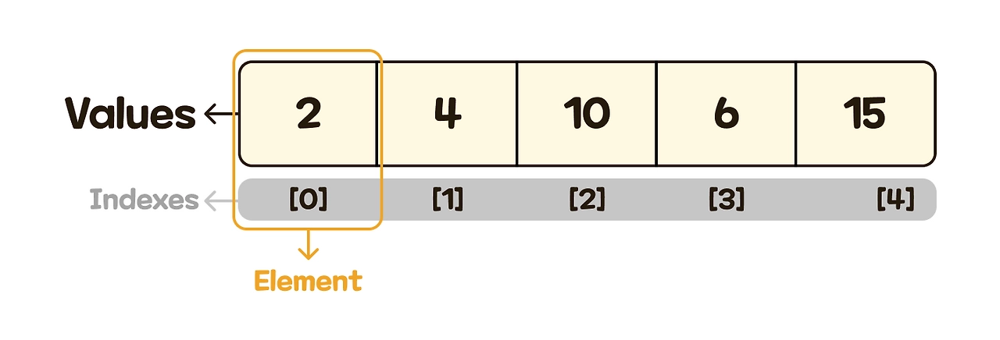
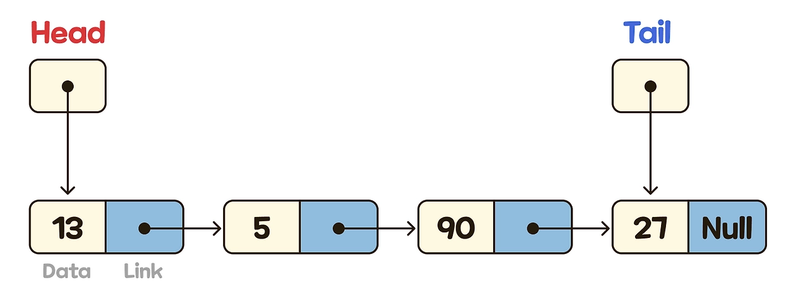
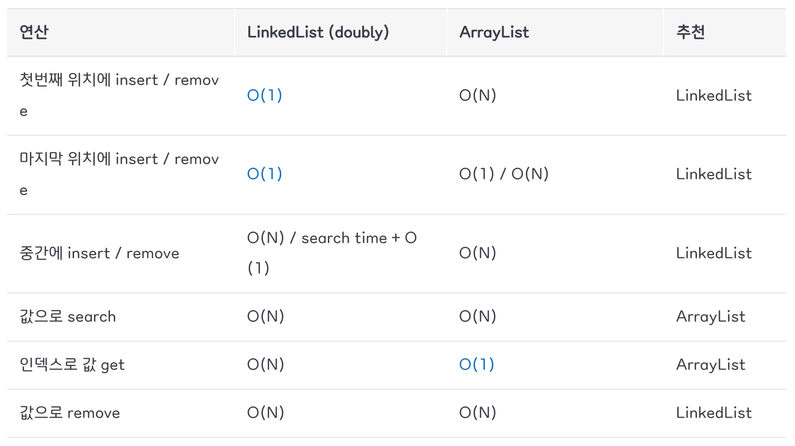

# 1. 개념 정리

---

## 배열(Array)

- 메모리 상에 같은 타입의 자료가 연속적으로 저장
- 인덱스(index)로 바로 접근 가능
- 논리적 저장 순서와 저장 순서가 일치함
- 구현 방식
  - 정적 배열: 크기가 고정
  - 동적 배열: 필요에 따라 크기 확장 가능
- 접근 → O(1)
- 삽입, 삭제 → O(N)

### 순차 리스트

- 배열 개념을 이용해 순차 리스트 구현 가능
- 순차 리스트의 구성 요소
  
  - Value : 실제 저장된 데이터 값
  - Index : 각 값의 위치를 나타내는 번호
  - Element : 값과 해당 인덱스를 포함한 하나의 구성 단위

### Java의 ArrayList

- 배열을 이용한 순차 리스트

**장점**

- 모든 데이터에 상수 시간으로 접근 가능

**단점**

- 배열 공간이 꽉 차거나, 요소 중간에 삽입을 행하려 할때 기존의 배열을 복사해서 요소를 뒤로 한칸씩 일일히 이동

---

## 리스트(List)

- 자료 구조의 관점에서 보면 리스트가 배열의 상위 개념
- 메모리 상에 데이터가 비연속적으로 저장됨
- 리스트는 크게 순차 리스트와 연결리스트로 나눌 수 있음

### 연결 리스트

- 연결 리스트(단일 연결리스트)의 구성 요소
  
  - Data : 저장하고자 하는 실제 값
  - Link : 다음 노드의 주소를 가리키는 포인터
  - Head : 첫 번째 노드의 주소를 저장
  - Tail : 마지막 노드의 주소를 저장
  - 마지막 노드의 Link : NULL 값을 가짐 (연결의 끝을 의미)
- 포인터의 변경만으로 삽입과 삭제가 가능하여 속도가 빠름
- 임의 접근은 불가능해 특정 위치 접근을 위해서는 순차적으로 탐색해야 함

### Java의 LikedList

- 노드를 연결해서 구성

**장점**

- 공간의 제약이 존재하지 않음
  - 불연속적으로 존재하는 데이터를 서로 연결(link)한 형태로 구성
- 삽입 / 삭제 처리 속도가 빠름
  - 삽입 역시 노드가 가리키는 포인터만 바꿔주면 됨

**단점**

- 요소에 접근할 때 순차접근만 가능함

### LinkedList는 의외로 잘 사용되지 않음

- 삽입/삭제가 빈번하면 → LinkedList
- 요소 가져오기가 빈번하면 → ArrayList
- 하지만 사실 성능면에서 큰 차이가 없음
- 자바 컬렉션 프레임워크 등 자바 플랫폼의 설계와 구현을 주도한 조슈아 블로치(Joshua Bloch)도 자신이 설계했지만 사용하지 않는다고 함
  

---

## ArrayList, LinkedList의 시간 복잡도 비교



---

# 2. 구현

---

## 배열(Array)

### 1. 값 넣기 / 수정 / 조회

```python
public class Main {
    public static void main(String[] args) {
        int[] arr = new int[5];

        arr[0] = 10;
        arr[1] = 20;
        arr[2] = 30;

        arr[1] = 99;

        System.out.println(arr[0]); // 10
        System.out.println(arr[1]); // 99
        System.out.println(arr[2]); // 30
    }
}
```

---

## 리스트 — ArrayList

### 1. add(E e) : 맨 뒤에 추가

```java
import java.util.*;

public class Main {
    public static void main(String[] args) {
        ArrayList<Integer> list = new ArrayList<>();

        list.add(10);
        list.add(20);
        list.add(30);

        System.out.println(list); // [10, 20, 30]
    }
}
```

### 2. add(int index, E element) : 특정 위치에 삽입

```java
import java.util.*;

public class Main {
    public static void main(String[] args) {
        ArrayList<Integer> list = new ArrayList<>();

        list.add(10);
        list.add(20);
        list.add(30);

        list.add(1, 15);

        System.out.println(list); // [10, 15, 20, 30]
    }
}
```

### 3. get(int index) : 특정 위치 값 조회

```java
import java.util.*;

public class Main {
    public static void main(String[] args) {
        ArrayList<Integer> list = new ArrayList<>();

        list.add(10);
        list.add(20);
        list.add(30);

        System.out.println(list.get(0)); // 10
        System.out.println(list.get(2)); // 30
    }
}
```

### 4. set(int index, E element) : 특정 위치 값 수정

```java
import java.util.*;

public class Main {
    public static void main(String[] args) {
        ArrayList<Integer> list = new ArrayList<>();

        list.add(10);
        list.add(20);
        list.add(30);

        list.set(1, 99);

        System.out.println(list); // [10, 99, 30]
    }
}
```

### 5. remove() : 값 삭제

- remove(int index) : 특정 위치 값 삭제

```java
import java.util.*;

public class Main {
    public static void main(String[] args) {
        ArrayList<Integer> list = new ArrayList<>();

        list.add(10);
        list.add(15);
        list.add(20);
        list.add(30);

        list.remove(1);

        System.out.println(list); // [10, 20, 30]
    }
}
```

- remove(Object o) : 값으로 삭제

```java
import java.util.*;

public class Main {
    public static void main(String[] args) {
        ArrayList<Integer> list = new ArrayList<>();

        list.add(10);
        list.add(20);
        list.add(30);
        list.add(20);

        list.remove(Integer.valueOf(20));

        System.out.println(list); // [10, 30, 20]
    }
}
```

### 6. size() : 크기 확인

```java
import java.util.*;

public class Main {
    public static void main(String[] args) {
        ArrayList<Integer> list = new ArrayList<>();

        list.add(10);
        list.add(20);
        list.add(30);

        System.out.println(list.size()); // 3
    }
}
```

### 7. isEmpty() : 비어 있는지 확인

```java
import java.util.*;

public class Main {
    public static void main(String[] args) {
        ArrayList<Integer> list = new ArrayList<>();

        System.out.println(list.isEmpty()); // true

        list.add(10);

        System.out.println(list.isEmpty()); // false
    }
}
```

### 8. contains(Object o) : 값 포함 여부 확인

```java
import java.util.*;

public class Main {
    public static void main(String[] args) {
        ArrayList<Integer> list = new ArrayList<>();

        list.add(10);
        list.add(20);
        list.add(30);

        System.out.println(list.contains(20)); // true
        System.out.println(list.contains(99)); // false
    }
}
```

### 9. clear() : 전체 삭제

```java
import java.util.*;

public class Main {
    public static void main(String[] args) {
        ArrayList<Integer> list = new ArrayList<>();

        list.add(10);
        list.add(20);
        list.add(30);

        list.clear();

        System.out.println(list); // []
        System.out.println(list.size()); // 0
    }
}
```

---
