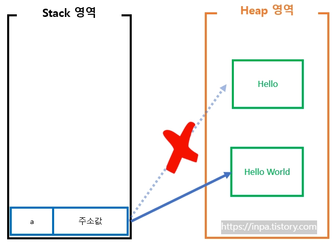
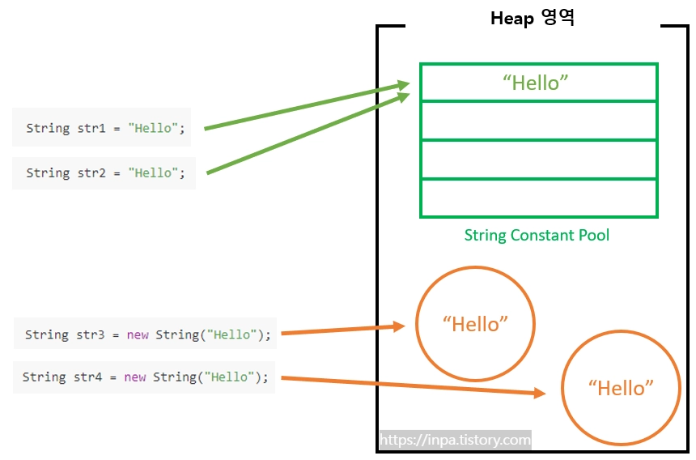

# 1. 개념 정리

---

## 문자열(String)

### String은 객체

- Java에서 `String`은 `int`, `char`과 달리 기본형(premitive type)이 아닌 참조형(refrence type) 변수
- 스택(stack) 영역이 아니라 객체와 같이 힙(heap)에서 문자열 데이터가 생성되고 다뤄짐

### String은 불변

- Java에서 String 객체의 값은 변경할 수 없음

  ```java
  String a = "Hello";
  a = a + " World";

  System.out.println(a); // Hello World
  ```

  

- 왜 불변을 설계 되었는가?
  1. 성능적 이득

     JVM(자바 가싱 머신)에서는 따로 String Constant Pool이라는 독립적인 영역을 만들고 문자열들을 Constant화 하여 다른 변수 혹은 객체들과 공유하게 되는데, 이 과정에서 데이터 캐싱이 일어나고 그 만큼 성능적 이득을 취할 수 있다.

  2. Multi-Thread 환경

     데이터가 불변(immutable) 하다면 Multi-Thread 환경에서동기화 문제가 발생하지 않기때문에 더욱 safe 한 결과를 낼 수 있다.

  3. 보안적인 측면

     예를 들어 데이터베이스 사용자 이름, 암호는 데이터베이스 연결을 수신하기 위해 문자열로 전달되는데, 만일 번지수의 문자열 값이 변경이 가능하다면 해커가 참조 값을 변경하여 애플리케이션에 보안 문제를 일으킬 수 있다.

### String 주소 할당 방식

1. 문자열 리터럴을 이용한 방식
   - string constant pool이라는 영역에 존재하게 됨

   ```java
   String str1 = "Hello";
   String str2 = "Hello";
   ```

2. new 연산자를 이용한 방식
   - Heap 영역에 존재하게 됨

   ```java
   String str3 = new String("Hello");
   String str4 = new String("Hello");
   ```



- 문자열 리터럴 값으로 할당한 두 변수 `str1`, `str2`는 같은 메모리 주소를 가리킴
- 메모리 절약 가능

---

# 2. 구현

---

## 문자열(String)

### 1. 문자열 생성

```java
public class Main {
    public static void main(String[] args) {
        String str = "Hello";

        System.out.println(str); // Hello
    }
```

### 2. length() : 문자열 길이 확인

```java
public class Main {
    public static void main(String[] args) {
        String str = "Hello";

        System.out.println(str.length()); // 5
    }
}
```

### 3. charAt(int index) : 특정 위치 문자 조회

```java
public class Main {
    public static void main(String[] args) {
        String str = "Hello";

        System.out.println(str.charAt(0)); // H
    }
}
```

### 4. substring(int beginIndex, int endIndex) : 문자열 자르기

```java
public class Main {
    public static void main(String[] args) {
        String str = "Hello World";

        System.out.println(str.substring(0, 5)); // Hello
    }
}
```

### 5. equals(Object obj) : 문자열 내용 비교

```java
public class Main {
    public static void main(String[] args) {
        String str1 = "Java";
        String str2 = "Java";
        String str3 = "java";

        System.out.println(str1.equals(str2)); // true
        System.out.println(str1.equals(str3)); // false
    }
}
```

### 6. contains(CharSequence s) : 특정 문자열 포함 여부 확인

```java
public class Main {
    public static void main(String[] args) {
        String str = "Hello World";

        System.out.println(str.contains("World")); // true
    }
}
```

### 7. replace(CharSequence target, CharSequence replacement) : 문자열 치환

```java
public class Main {
    public static void main(String[] args) {
        String str = "I like Java";

        System.out.println(str.replace("Java", "Python")); // I like Python
    }
}
```

### 8. split(String regex) : 문자열 분리

```java
public class Main {
    public static void main(String[] args) {
        String str = "apple,banana,grape";

        String[] arr = str.split(",");

        System.out.println(arr[0]); // apple
        System.out.println(arr[1]); // banana
        System.out.println(arr[2]); // grape
    }
}
```

---
