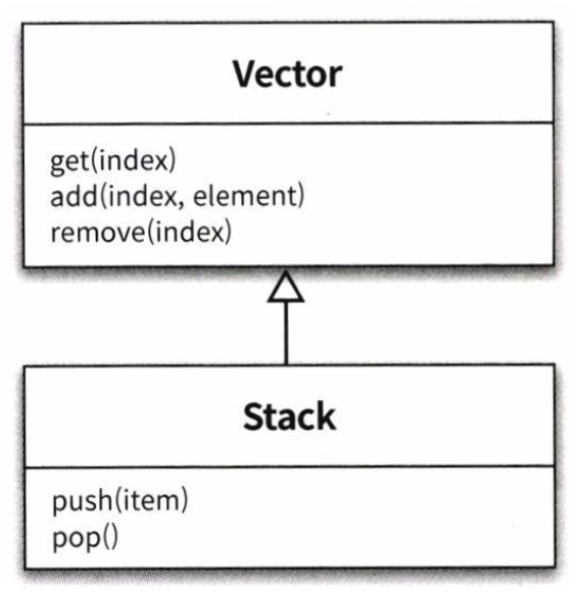
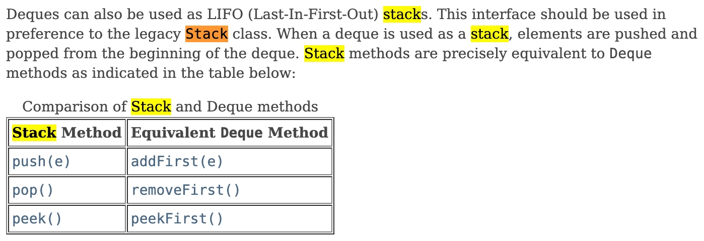

# 1. 개념 정리

---

### LIFO 구조

- 스택은 마지막에 저장한 데이터를 가장 먼저 꺼내는 **LIFO (Last In First Out)** 구조
- FIFO 구조인 큐(Queue)와 대비
- **주요 연산(**push, pop, peek)**의 시간 복잡도가** 모두 `O(1)`
- **주요 활용 예시**:
  - 함수 호출 스택(call stack)
  - 괄호 짝 맞추기
  - DFS
  - 수식 계산(후위 표기법)
  - undo 기능
  - 브라우저 뒤로가기

## `Stack` 클래스 → 사용 X

### Vector 클래스를 상속

- 자바의 `Stack` 클래스는 `Vector` 클래스를 상속받음
  - **Vector 클래스?**
    - `List` 인터페이스를 구현하는 컬렉션
    - 모든 메서드에 `synchronized` 키워드가 붙어 있어 멀티 스레드 환경에서 안전함
    - 하지만 Vector 클래스는 obsolete/legacy(구식) 클래스이며 성능이 좋지 않음
    - 단일 스레드 환경에서는 동기화 오버헤드 때문에 `ArrayList`보다 성능이 떨어짐
    - Collections Framework가 도입되면서 사실상 `ArrayList`로 대체됨
- 따라서 `Tread-Safe`하다는 특징을 가짐
- 하지만 다음의 이유로 Stack 클래스는 사용하지 않음
  - 부모 클래스인 Vector 클래스는 현재 쓰이지 않는 오래된 클래스이기 때문에 성능이 안 좋고 취약점이 많음
  - Stack은 LIFO 동작만 구현해야 하는데, Vector를 상속함으로써 `add(index, element)`, `remove(index)`처럼 임의 위치에 접근하는 메서드까지 전부 노출되어 LIFO 규악이 깨질 수 있음
    
  - Java 공식 문서에서도 `Deque` 사용을 권장함
    - "deque는 LIFO 스택으로도 사용할 수 있으며, legacy인 Stack 클래스보다 이 인터페이스를 우선적으로 사용해야 한다"고 명시
      

## Deque 클래스 → 사용 O

- Double Ended Queue의 줄임말, "덱"이라고 읽음
- 양 끝에서 삽입/삭제가 가능한 자료구조 → 큐로도, 스택으로도 쓸 수 있음
- 인터페이스이므로 여러 구현체 중 선택 가능
  - `ArrayDeque` ← 스택 용도로 가장 권장
    - 스택으로 사용될 때 Stack보다 빠르고, 큐로 사용될 때 LinkedList보다 빠름
    - 대부분의 연산이 amortized O(1)로 동작함
    - 내부적으로 resizable array로 구현되어 있음
    - null 원소는 허용하지 않음
    - 단, thread-safe하지 않으므로 멀티 스레드 환경에서는 외부 동기화나 `ConcurrentLinkedDeque`를 사용해야 함
  - `LinkedList`
  - `ConcurrentLinkedDeque`
  - `LinkedBlockingDeque`

---

# 2. 구현

---

## 선언

```java
import java.util.ArrayDeque;
import java.util.Deque;

Deque<Integer> stack = new ArrayDeque<>();
// 초기 용량 지정도 가능 (내부 배열 크기)
Deque<Integer> stack2 = new ArrayDeque<>(16);
```

## 주요 메서드

| 동작      | Deque 메서드  | 설명                                      | 비어있을 때              |
| --------- | ------------- | ----------------------------------------- | ------------------------ |
| 삽입      | `push(e)`     | 맨 앞에 추가 (= `addFirst`)               | -                        |
| 제거      | `pop()`       | 맨 앞 원소 제거 후 반환 (= `removeFirst`) | `NoSuchElementException` |
| 조회      | `peek()`      | 맨 앞 원소 조회 (= `peekFirst`)           | `null` 반환              |
| 크기      | `size()`      | 원소 개수                                 | -                        |
| 비었나?   | `isEmpty()`   | 비어있으면 true                           | -                        |
| 포함?     | `contains(e)` | 원소 포함 여부 (`O(n)`)                   | -                        |
| 전체 삭제 | `clear()`     | 모든 원소 제거                            | -                        |

## 사용 예시

```java
import java.util.ArrayDeque;
import java.util.Deque;

public class StackExample {
  public static void main(String[] args) {
    Deque<Integer> stack = new ArrayDeque<>();

    // 삽입
    stack.push(1);
    stack.push(2);
    stack.push(3);
    System.out.println(stack);        // [3, 2, 1]  (앞이 top)

    // 조회
    System.out.println(stack.peek()); // 3
    System.out.println(stack.size()); // 3

    // 제거
    System.out.println(stack.pop());  // 3
    System.out.println(stack.pop());  // 2
    System.out.println(stack);        // [1]

    // 비었는지 확인
    System.out.println(stack.isEmpty()); // false

    // 안전한 제거 (비어있으면 null 반환)
    stack.pollFirst(); // 1
    System.out.println(stack.pollFirst()); // null (예외 X)
  }
}
```
