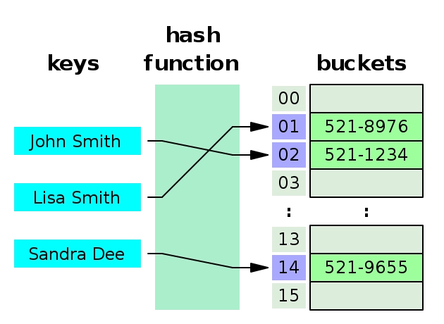

## 1. 기본 개념



### 해시 함수 (Hash Function)

임의의 데이터를 고정된 크기의 값(해시값)으로 변환하는 함수

- 같은 입력 → 항상 같은 해시값
- 해시값으로 원본 데이터를 역산하기 어려움

### 해시 테이블 (Hash Table)

해시 함수를 이용해 키(key)를 인덱스로 변환하고, 해당 위치에 값을 저장하는 자료구조

- 변환 방법
    <aside>
    
    - 기본적으로 인덱스 = hash(key) % 배열 크기
    - 속도 최적화를 위해 비트 연산(`& mask`), 배열 크기 항상 2의 거듭제곱으로 유지
    - hash % 8 == hash & 0b111
    </aside>

- **평균 시간복잡도**: O(1) — 탐색, 삽입, 삭제
- **최악 시간복잡도**: O(n) — 해시 충돌이 많을 때

### 해시 충돌 (Hash Collision)

서로 다른 키가 같은 해시값을 가지는 경우. 평균 O(1)이지만 최악 O(n)이 되는 원인

대표적인 해결 방법:

- 체이닝(Chaining): 같은 버킷에 연결 리스트로 연결
- 개방 주소법(Open Addressing): 충돌 시 다른 빈 버킷을 탐색

---

## 2. Python 구현체

### 상속 관계

```
해시 테이블
 ├── set
 └── dict
      ├── collections.defaultdict  (dict 상속)
      └── collections.Counter      (dict 상속)
```

`defaultdict`와 `Counter`는 `dict`를 상속해서 기능을 확장한 서브 클래스

---

### dict

- 가장 기본적인 해시 테이블 구현체
- 키-값 쌍을 저장

```python
d = {}
d["apple"] = 3
d["banana"] = 5

d["apple"]      # 3
d["grape"]      # KeyError 발생
d.get("grape")  # None (KeyError 발생 X)
```

**활용 예시**: 빈도 카운팅, 그래프 인접 리스트, 메모이제이션

```python
# 문자 빈도 카운팅
freq = {}
for c in "abracadabra":
    freq[c] = freq.get(c, 0) + 1
# {'a': 5, 'b': 2, 'r': 2, 'c': 1, 'd': 1}
```

---

### set

- 값만 있고 키가 없는 해시 테이블
- 중복 X
- 집합 연산 지원

```python
s = {1, 2, 3, 3}  # {1, 2, 3}

2 in s  # True — O(1)

s1 = {1, 2, 3}
s2 = {2, 3, 4}
s1 & s2  # 교집합 {2, 3}
s1 | s2  # 합집합 {1, 2, 3, 4}
s1 - s2  # 차집합 {1}
```

**활용 예시**: 중복 제거, 방문 여부 확인, 교집합/차집합 연산

```python
# 두 배열의 공통 원소
a = [1, 2, 3, 4]
b = [3, 4, 5, 6]
set(a) & set(b)  # {3, 4}
```

---

### collections.defaultdict

- 없는 키 조회 시 0 반환

```python
from collections import defaultdict

# 기본값: 빈 리스트
graph = defaultdict(list)
graph[1].append(2)
graph[1].append(3)
# {1: [2, 3]}

# 기본값: 0
counter = defaultdict(int)
for c in "hello":
    counter[c] += 1
# {'h': 1, 'e': 1, 'l': 2, 'o': 1}
```

**활용 예시**: 그래프 인접 리스트, 그룹핑, 빈도 카운팅

```python
# 그룹핑
words = ["apple", "banana", "avocado", "blueberry"]
groups = defaultdict(list)
for w in words:
    groups[w[0]].append(w)
# {'a': ['apple', 'avocado'], 'b': ['banana', 'blueberry']}
```

---

### collections.Counter

- 빈도 카운팅에 특화된 dict 서브클래스
- 없는 키 조회 시 0 반환
- 산술 연산 지원

```python
from collections import Counter

c = Counter("abracadabra")
# Counter({'a': 5, 'b': 2, 'r': 2, 'c': 1, 'd': 1})

c["a"]           # 5
c["z"]           # 0
c.most_common(2) # [('a', 5), ('b', 2)]

# 연산
a = Counter([1, 2, 2, 3, 3, 3])
b = Counter([2, 3, 3])
a - b  # Counter({3: 1, 1: 1, 2: 1})
a + b  # Counter({3: 5, 2: 3, 1: 1})
a & b  # Counter({2: 1, 3: 2})
a | b  # Counter({3: 3, 1: 1, 2: 2})
```

**활용 예시**: 빈도 카운팅, 애너그램 판별, 최빈값 찾기

```python
# 애너그램 판별
def is_anagram(s, t):
    return Counter(s) == Counter(t)

is_anagram("listen", "silent")  # True
```

---
